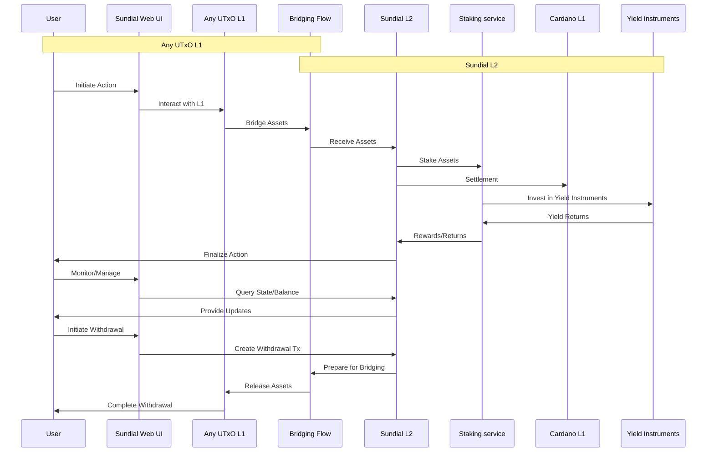
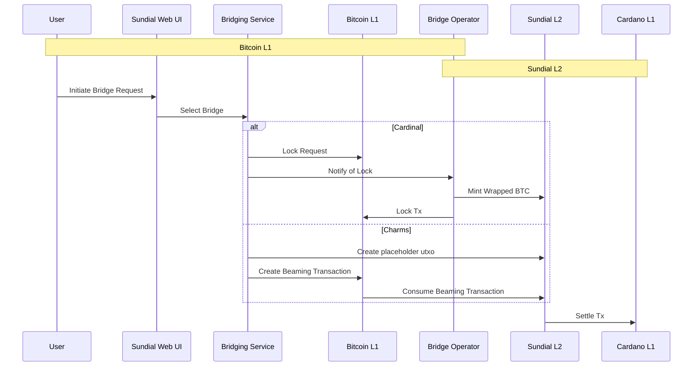
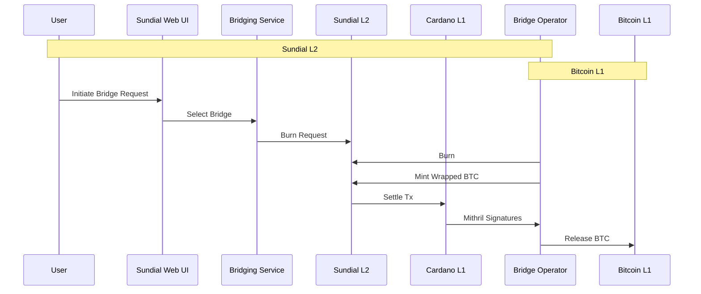
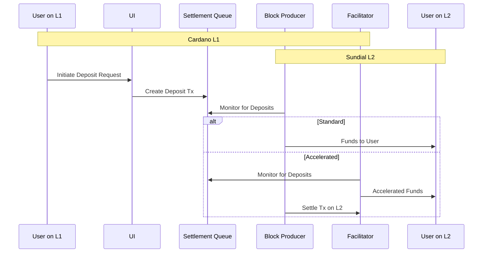
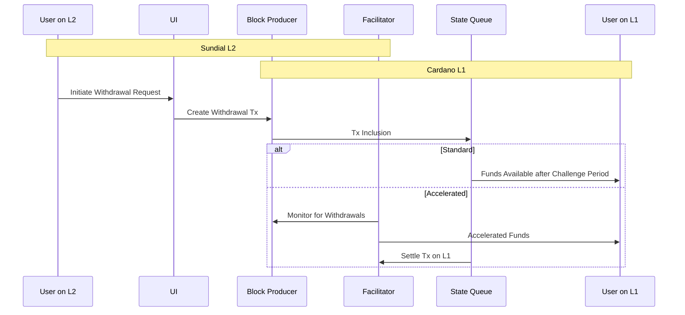

# Component Interactions / Data Flow

This document contains sequence diagrams illustrating the flow of assets and data between the various components of the Sundial architecture. For more detailed information on each component, please refer to the respective architecture documents.

## Integration Points

## Bridge Flow (Bitcoin to Sundial)
Bridging can look pretty different based on the bridge used. This diagram illustrates the flow for both the Cardinal and Charms bridges.

## Bridge Flow (Sundial to Bitcoin)
Unlocking for Charms & Cardinal bridges both rely on similar mechanisms involving Mithril threshold signatures.

## Deposit Flow (Cardano to Sundial)

## Withdrawal Flow (Sundial to Cardano)
