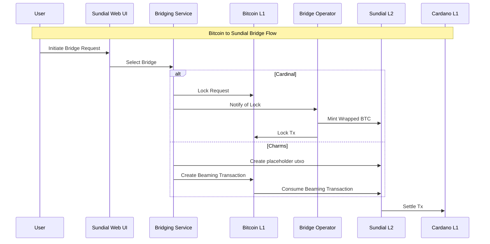
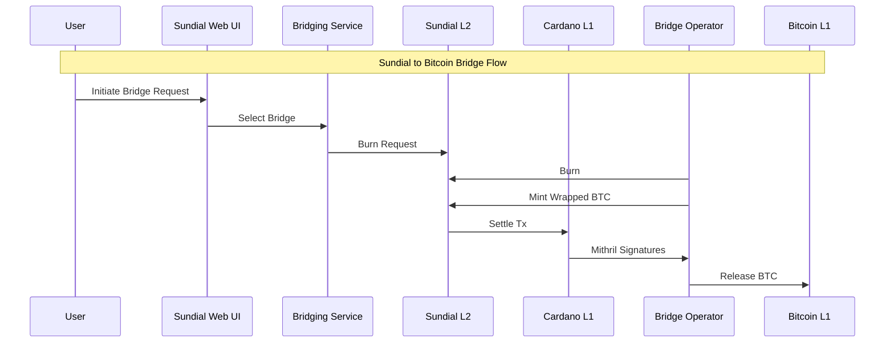

# Component Interactions / Data Flow

## Bridge Flow (Bitcoin to Sundial)
Bridging can look pretty different based on the bridge used. This diagram illustrates the flow for both the Cardinal and Charms bridges.

## Bridge Flow (Sundial to Bitcoin)
Unlocking for Charms & Cardinal bridges both rely on similar mechanisms involving Mithril threshold signatures.

## Settlement Flow
TODO

