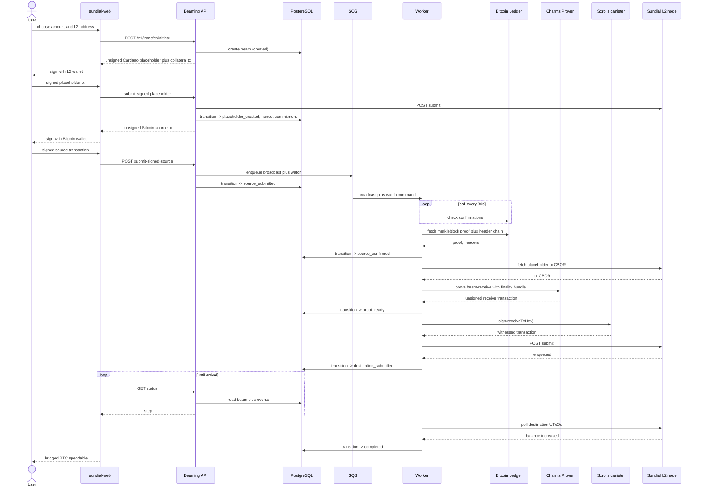

```mermaid
sequenceDiagram
    actor U as User
    participant FE as sundial-web
    participant API as Beaming API
    participant PG as PostgreSQL
    participant Q as SQS
    participant W as Worker
    participant MP as Bitcoin Ledger
    participant CP as Charms Prover
    participant SC as Scrolls canister
    participant L2 as Sundial L2 node

    U->>FE: choose amount and L2 address
    FE->>API: POST /v1/transfer/initiate
    API->>PG: create beam (created)

    API-->>FE: unsigned Cardano placeholder plus collateral tx
    FE-->>U: sign with L2 wallet
    U->>FE: signed placeholder tx
    FE->>API: submit signed placeholder
    API->>L2: POST submit
    API->>PG: transition -> placeholder_created, nonce, commitment

    API-->>FE: unsigned Bitcoin source tx
    FE-->>U: sign with Bitcoin wallet
    U->>FE: signed source transaction
    FE->>API: POST submit-signed-source
    API->>Q: enqueue broadcast plus watch
    API->>PG: transition -> source_submitted

    Q->>W: broadcast plus watch command

    loop poll every 30s
    W->>MP: check confirmations
    end
    W->>MP: fetch merkleblock proof plus header chain
    MP-->>W: proof, headers
    W->>PG: transition -> source_confirmed

    W->>L2: fetch placeholder tx CBOR
    L2-->>W: tx CBOR
    W->>CP: prove beam-receive with finality bundle
    CP-->>W: unsigned receive transaction
    W->>PG: transition -> proof_ready

    W->>SC: sign(receiveTxHex)
    SC-->>W: witnessed transaction
    W->>L2: POST submit
    L2-->>W: enqueued
    W->>PG: transition -> destination_submitted

    loop until arrival
        FE->>API: GET status
        API->>PG: read beam plus events
        API-->>FE: step
    end

    W->>L2: poll destination UTxOs
    L2-->>W: balance increased
    W->>PG: transition -> completed
    FE-->>U: bridged BTC spendable
```