# Architectural Overview

The architecture of Sundial is divided into 7 layers, the first 2 of which are the Layer 1 (Cardano) and Layer 2 (Sundial) protocols. The remaining layers are built to enable ease of use and integration with the protocol, as well as to provide a user-friendly experience.

This document provides an overview of the architecture, including the key services and their interactions. The architecture is designed to be modular and extensible, allowing for future enhancements and integrations.

## Incentive System Overview

```mermaid
graph TB
    subgraph "Protocol Treasury"
        TR[Protocol Treasury]
        FR[Fee Revenue]
        YR[Yield Revenue]
        BR[Bridge Revenue]
    end
    
    subgraph "Operators (Staked)"
        BP[Block Producers]
        BO[Bridge Operators]
    end
    
    subgraph "Watchers (Competitive)"
        PR[Provers]
        CA[Canaries]
        AR[Archivists]
        FA[Facilitators]
    end
    
    subgraph "Liquidity Providers"
        LP[LP Participants]
        YI[Yield Instruments]
    end
    
    subgraph "Users"
        US[End Users]
    end
    
    subgraph "Penalty System"
        SL[Slashing]
        FP[Fraud Penalties]
    end
    
    %% Revenue Flow
    US -->|Transaction Fees| FR
    US -->|Bridge Fees| BR
    LP -->|Yield Generation| YR
    FR --> TR
    BR --> TR
    YR --> TR
    
    %% Operator Incentives
    TR -->|Block Rewards| BP
    TR -->|Bridge Fees Share| BO
    BP -->|Stake Deposit| BP
    BO -->|Stake Deposit| BO
    
    %% Watcher Incentives
    TR -->|Fraud Bounties| PR
    TR -->|Issue Bounties| CA
    TR -->|Data Bounties| AR
    TR -->|Facilitation Fees| FA
    
    %% Liquidity Provider Incentives
    YI -->|Yield Returns| LP
    TR -->|LP Rewards| LP
    
    %% Penalty Flow
    BP -->|Slashed Stake| SL
    BO -->|Slashed Stake| SL
    SL -->|Redistributed| TR
    PR -->|Fraud Detection| FP
    FP -->|Penalty Revenue| TR
    
    %% User Benefits
    TR -->|Protocol Improvements| US
    LP -->|Liquidity| US
    BP -->|Fast Transactions| US
    BO -->|Cross-chain Access| US
    
    classDef operator fill:#e1f5fe,stroke:#01579b
    classDef watcher fill:#f3e5f5,stroke:#4a148c
    classDef liquidity fill:#e8f5e8,stroke:#1b5e20
    classDef user fill:#fff3e0,stroke:#e65100
    classDef treasury fill:#fce4ec,stroke:#880e4f
    classDef penalty fill:#ffebee,stroke:#b71c1c
    
    class BP,BO operator
    class PR,CA,AR,FA watcher
    class LP,YI liquidity
    class US user
    class TR,FR,YR,BR treasury
    class SL,FP penalty
```

## L1: Cardano

Layer 1 is the Cardano blockchain, which provides the foundational layer for Sundial. It was selected because the Cardano blockchain is known for its security, scalability, and sustainability.

Cardano hosts a suite of smart contracts that Sundial uses to manage its operations. These include a state queue, settlement queue, scheduler, deposit contract, an operator registry, and a suite of contracts for proving fraud on the L2 in a fully deterministic manner.

Cardano will also probably also be used as a Data Availability (DA) layer, which means that it will store the data needed for Sundial to operate. As an optimistic rollup, Sundial only publishes block headers into the state queue. The DA layer ensures that block data is secure and can be accessed by anyone who needs it for fraud proving or other onchain purposes.

## L2: Sundial

Layer 2 is the Sundial protocol itself, which is built on top of the Cardano blockchain. It provides the core functionality for the protocol, including the state queue, settlement queue, and scheduler.

Sundial is built with the Midgard L2 Framework, which is a set of tools and libraries that make it easier to build Layer 2 protocols on Cardano. It provides a set of abstractions for managing state, transactions, and other core functionality. Included in this layer are the services mentioned above, as well as the following:

- **Data Archive**: A decentralized, data-duplicated service that stores historical data for the protocol, allowing users to access past transactions and states.
- **Data Availability (DA) Layer**: This layer ensures that the data needed for Sundial to operate is securely stored and accessible. It is likely to be implemented on Cardano, leveraging its robust infrastructure.

## SL3: Data Layer

The Data Layer has 3 main services:

- **Indexers** provide a way to index and query data from the protocol, allowing users to access historical data and perform analytics. They also should provide a way to view the upcoming block producers, enabling wallets to intelligently broadcast their transactions to the relevant operators. (Assuming a VRF rotation instead of round-robin.)
- **Security Services** provide a way to ensure the security of the protocol, including fraud detection and prevention mechanisms. These services are designed to be modular and extensible, allowing for future enhancements and integrations.

## SL4: Construction Layer

The Construction Layer provides a set of tools and libraries for building applications on top of the Sundial protocol. It includes the following services:

- **Offchain Specifications**: A set of specifications that define how applications can construct transactions and interact with the protocol. These are intended to be backwards compatible with Cardano's CIP-30 wallet standard, allowing for easy integration with existing wallets and applications.
- **Wallet Specifications**: A set of specifications that define how wallets can interact with the protocol, including transaction construction and signing. This includes specifications for interacting with both the Bitcoin and Cardano networks, as well as the Sundial L2.
- **Shared Liquidity Pools**: A set of liquidity pools that can be used by applications to provide liquidity for their transactions. The initial design includes pools for stablecoins, wrapped bitcoin, and native Ada.

## SL5: Function Layer

The Function Layer includes a suite of commonly desired use cases that will be made available to users as an inherent part of the protocol. They include:

- **Bridges** between Bitcoin and Cardano: These bridges will allow users to move assets between the two networks, enabling cross-chain transactions and interactions. We're exploring the use of several bridges in development, including implementations by IOG, BitcoinOS, FluidTokens and others.
- **Yield Instruments**: These will allow users to earn yield on their assets, providing a way to generate passive income. The yield instruments will be designed to be secure and easy to use, allowing users to earn yield without having to manage complex strategies. They will allow users to choose where their yield is generated by selecting from a range of options, to tailor their risk and return profiles.
- **Watchers**: These are services that monitor the protocol for specific events or conditions, such as fraud detection or accelerated deposits/withdrawals. They will operate as independent actors, and incentivized to provide accurate and timely information to users.

## SL6: Routing Layer

The Routing Layer provides a set of smart services that interprets and prepares user inputs for interaction in the Function Layer. This includes:

- **Bridging Services**: These services will facilitate user interactions with the bridges, allowing them to move assets between Bitcoin and Cardano networks seamlessly. It will also monitor the status of the bridges and provide users with real-time information about their transactions.
- **Staking Services**: These services will allow users to stake their assets in the protocol, earning rewards for participating in the network. They will be designed to be easy to use and secure, allowing users to stake their assets without having to manage complex strategies.
- **Settlement Market**: This service will provide a marketplace for users to settle their transactions, allowing them to find their ideal balance between speed & cost for their deposits & withdrawals. It will be designed to be secure and easy to use, allowing users to settle their transactions quickly and efficiently.

## SL7: User Layer

The User Layer is the topmost layer of the architecture, providing a user-friendly interface for interacting with the protocol. It includes:

- **User Interfaces**: These are the front-end applications that users interact with, including web and mobile applications. They will be designed to be intuitive and easy to use, allowing users to interact with the protocol without needing to understand the underlying complexities.
- **User Actions API**: This API will provide a way for users to interact with the services in SL6 and SL5 programmatically. It will be designed to be easy to use and secure, allowing developers to build applications without having to manage complex interactions with the protocol.
