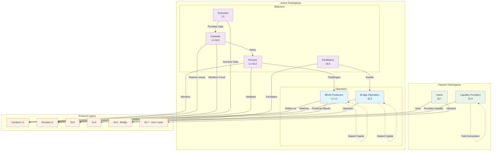

# Community Roles on Sundial

Sundial has a number of roles that need to be filled by members of the community to maintain efficiency and security. These fall naturally into 4 categories, in which each role requires similar context.

## Role Relationships Overview

## Operators

Operators have an active role in the protocol, making decisions on their own initiative, with their own liquidity at stake to ensure only specified behavior is incentivized.

In return, operators are registered and included in the protocol itself, given opportunities to earn rewards upon faithful execution of their tasks.

### Block Producers (L1-L2)

### Bridge Operators (SL5)

Information about Bridge Operation is still TBD as we work with different bridging solutions. Most likely this will include several sub-roles for operators who choose to operator only 1 bridge.

Bridge Operation requires watching both the Cardano L1 and the Bitcoin L1, as well as (perhaps) interacting with other bridge operators.

## Watchers

Watchers have a reactive role in the protocol, facilitating (or counteracting in the case of Provers) the actions of other users to enable a smoother, more secure experience.

Watchers are incentivized to take on tasks, but are not specifically incorporated into the protocol. They must compete for rewards against other watchers.

### Provers (L1-SL3)

### Facilitators (SL5)

### Canaries (L1-SL5)
Canaries are a type of watcher that monitor the L2 directly for fraud and other issues. They are not required to stake any collateral, but they are incentivized to report any issues they find.

They play a crucial role in maintaining the integrity of the network by providing the first line of defense against fraud and other malicious activities.

### Archivists (L2)
Archivists are responsible for maintaining the integrity of the data stored in the protocol. They ensure that historical data is accurately recorded and accessible, providing a reliable source of information for users and other services.
[REVIEW - should this be an Operator role?]

## Liquidity Providers (SL4)

Liquidity Providers have a passive role in the protocol, adding to the security, speed and stability of the chain by providing their own liquidity as a reserve and receiving yield in return.

## Users (SL7)

Users take whatever role they wish in the protocol. They are not anticipated to act in any way except in their own self interest, however the existence of users in the protocol is still a key component, providing motion and life to an otherwise predictable machine.
