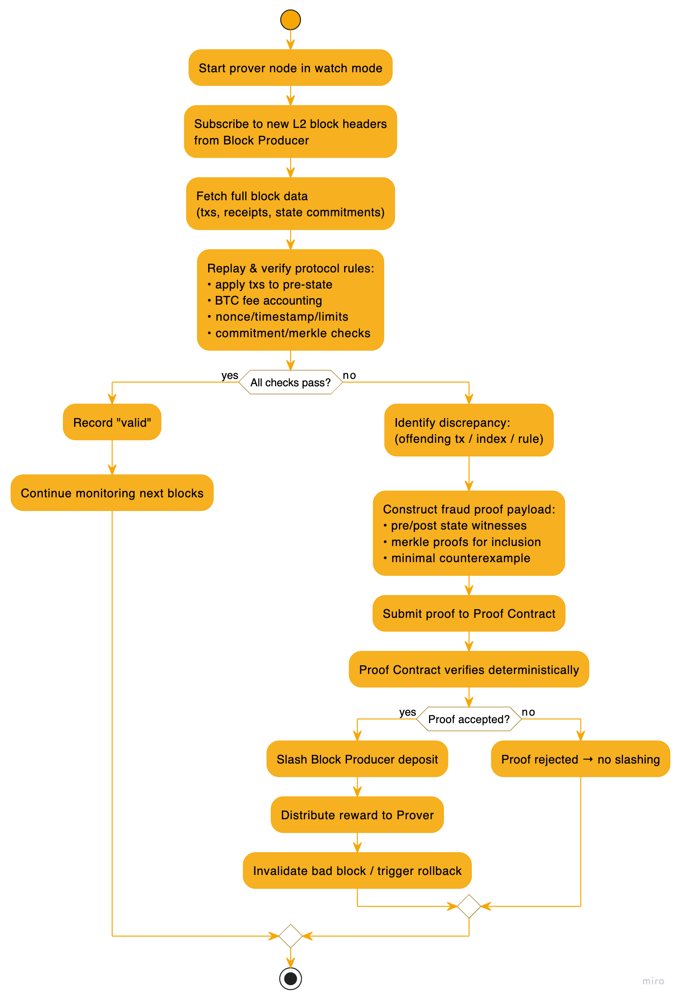

# Watchers

Watchers are a role on Sundial that take a reactive role in the blockchain and don't require any collateral or reservation to participate.

There are 4 types of watcher roles available. Each of these have similar requirements, so it makes sense for most watchers to take on all or most of these roles.

- Provers
- Facilitators
- Canaries
- Archivists

Incentives for each of these roles are described in more detail [here](./watcher-incentives.md).

## Tooling

To support watchers in their roles, we provide a comprehensive watcher toolkit. Information on the watcher toolkit can be found [here](../layers/SL7/watcher-toolkit.md).

## Types of Watchers

### Provers (L1-SL3)

Provers are responsible for verifying the state of the blockchain and ensuring that transactions are valid. They play a crucial role in maintaining the integrity of the network by watching for any discrepancies or malicious activity.

When a block is produced, provers will verify the transactions within that block and ensure they adhere to the protocol's rules. If they detect any issues they can submit a proof to the network and earn the block producer's deposit as a reward.

We intend to require a significant deposit as collateral for the block producer role, which means any successful prover will be able to earn a significant reward for their work. However, since this process is deterministic, it's unlikely that this will be a common occurrence.

### Facilitators (SL5)

Facilitators are responsible for monitoring the network for accelerated deposits/withdrawals. They act as voluntary intermediaries, helping to coordinate transactions more swiftly in return for a fee.

These occurrences will be frequent, but the fees will be small, so facilitators will need to be able to handle a large volume of transactions to make it worth their while. They will also need to be able to quickly validate & fulfill orders to ensure that users receive their funds as soon as possible.

### Canaries (L1-SL5)

Canaries are an opt-in service for users who want additional security and peace of mind. They monitor the L2 directly for fraud and other issues, providing a first line of defense against malicious activities.

They are not required to stake any collateral, but they are given freedom to determine the terms of their service, including the fees they charge and the conditions under which they will report issues. This allows them to tailor their services to the needs of their users while still providing a valuable service to the network, and allows Sundial to take a hands-off approach to supporting Canaries.

### Archivists (L2)

Archivists are responsible for maintaining the integrity of the data stored in the protocol. They ensure that historical data is accurately recorded and accessible, providing a reliable source of information for users and other services.

Archivists will be incentivized to store data based on the availability of the data and the demand for it. They will be able to charge fees for accessing their data, allowing them to earn a profit while still providing a valuable service to the network.
