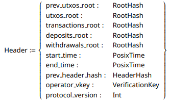

# Scaling Sundial

This document covers some of the ways in which Sundial is designed to scale as needed to ensure a fast & unobtrusive UX.

# L2 Scaling - Rapid Block Production

The Sundial L2 has technically infinite TPS. This is made possible by using a rotating consensus algorithm in which node operators do not need to interact directly to produce blocks. This allows each operator to commit as many blocks in their shift as they wish. The upper limit is simply the operators hardware.

There are 2 ways in which this is intended to be scaled. If we treat the data as a stream, we can optimize for volumetric flow, using the following levers:

1. Flow Volume
2. Flow Velocity

## Flow Volume: Block Size Increase

The block headers that operators publish in the state queue are of constant size.

This means we can increase the block size, which in turn increases the _flow volume_ of data that can be processed in parallel, allowing for greater throughput without any additional onchain cost.

## Flow Velocity: Operator Commitment Increase

The second way to scale the L2 is to increase the speed of operators who are committed to producing blocks. This can be done by optimizing their hardware, improving their network connections, and enhancing the overall efficiency of their block production processes.

The simplest way to do this is to increase the minimum commitment that operators must make in order to participate in block production. This will naturally limit the number of operators who can participate, but it will also ensure that those who do are able to produce blocks more quickly and efficiently.

# Cross-Chain Scaling - Facilitator Watchers

The Sundial protocol is designed to facilitate cross-chain transactions and interactions, particularly between the Cardano and Bitcoin networks. This is achieved through the use of Facilitator Watchers, who play an auxiliary role in ensuring that transactions are executed smoothly across chains.

Facilitators watch for transactions that need to be executed across chains and act as voluntary intermediaries, helping to coordinate the transaction more swiftly in return for a fee.

This allows users to quickly move between chains without having to wait for confirmations on both sides. Instead, the Facilitator takes on the burden of waiting and provides the required liquidity on the target chain immediately.
