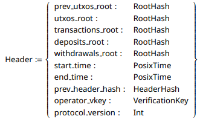

# Scaling Sundial

This document covers some of the ways in which Sundial is designed to scale as needed to ensure a fast & unobtrusive UX.

# L2 Scaling

## Transaction Processing

The Sundial L2 has technically infinite TPS. This is made possible by using a rotating consensus algorithm in which node operators do not need to interact directly to produce blocks. This allows each operator to commit as many blocks in their shift as they wish. The upper limit is simply the operators hardware.

There are 2 ways in which this is intended to be scaled. If we treat the data as a stream, we can optimize for volumetric flow, using the following levers:

1. Flow Volume
2. Flow Velocity

### Flow Volume: Block Size Increase

The block headers that operators publish in the state queue are of constant size.

This means we can increase the block size, which in turn increases the _flow volume_ of data that can be processed in parallel, allowing for greater throughput without any additional onchain cost.

### Flow Velocity: Operator Commitment Increase

The second way to scale the L2 is to increase the speed of operators who are committed to producing blocks. This can be done by optimizing their hardware, improving their network connections, and enhancing the overall efficiency of their block production processes.

The simplest way to do this is to increase the minimum commitment that operators must make in order to participate in block production. This naturally limits the number of operators who can participate, but it also ensures that those who do are able to produce blocks more quickly and efficiently.

## TPS (Transactions Per Second)

Since the L2 has technically infinite TPS, there is no hard limit to the number of transactions that can be processed per second.

The limiting factor is the processing capabilities of the node and node operators' hardware & network capabilities.

### Current TPS

The Sundial L2 in its current immature state has achieved a TPS of approximately 800.

### Anticipated TPS

Although the theoretical TPS of the L2 is infinite, we estimate the practical TPS to be significantly lower due to real-world constraints. Factors such as network latency, hardware limitations, and the efficiency of offchain computation all play a role in determining the actual TPS that can be achieved.

$$
TPS = log_{2}(N_{tx} * \lambda_{hash}) + N_{tx} * \lambda_{proc}
$$

Where:

- $$N_{tx}$$ = Number of transactions received through the network within the frequency of a Cardano block (currently ~20s).
- $$\lambda_{hash}$$ = Time taken for transactions core components to be added to the merkle hashes in the block header by the node.
- $$\lambda_{proc}$$ = Time taken to process a transaction and place it in a block by the node.

We estimate a $$\lambda_{proc}$$ of approximately 40μs and a $$\lambda_{hash}$$ of approximately 1ms, giving us an estimated TPS of approximately 24,985 TPS in the current network conditions.

## Finality & Latency

Sundial is able to offer fast finality and low latency for transactions on the L2, with an upper limit of ~20 seconds for finality. This is made possible by the optimistic rollup design, which allows transactions to be processed off-chain and then settled on-chain in batches with a deterministic proving system that allows to treat unmerged blocks as final.

### Latency

**Latency** is defined as the time it takes for a transaction to be included in a block after it has been submitted & made available to view by the block producer.

In the typical operating case, the block producing node is publishing its work as it goes, allowing for near-instant finality for any participant willing to independently verify the validity (and therefore inevitability) of all unmerged blocks.

$$
\lambda_{tx} = \lambda_{network} + \lambda_{bp}
$$

Where:

- $$\lambda_{network}$$ = Time taken for the transaction to propagate through the network to and from the block producer.
- $$\lambda_{bp}$$ = Time taken for the block producer to include the transaction in a new block.

Even in the worst case, the blocks are published on the L1 via the Data Availability Layer, which has a latency of approximately 20 seconds. This means that the maximum latency for a transaction to be included in a block is approximately 20 seconds.

$$
\lambda_{tx} = \lambda_{network} + \lambda_{bp} + ~20s
$$

### Finality

**Practical Finality** is defined as the time it takes for a transaction to be included in a block and for that block to be considered final from a user's perspective.

$$
\lambda_{pl} = \lambda_{tx} + \lambda_{oct}
$$

Where:

- $$\lambda_{oct}$$ = Offchain Confirmation Time (OCT): time it takes for a trusted offchain service to independently verify the validity of all blocks in the state queue & confirm to the user.

The offchain confirmation time is very low. For each block in the state queue, the service only needs to:

- Verify Inclusion: the hashed contents of each block matches the header in the state queue. The hashing process makes use of the Blake2b-224 hash in O(log(n)) time, allowing for extremely fast verification even in the case of very large blocks.
- Verify Validity: each block is valid, meaning all transactions in the block are valid and the state transition from the previous block to the current block is valid. This is done using a highly optimized Plutus interpreter that specifically looks for fraud proofs.

To even further reduce the effect of OCT, watchers are designed to store block confirmations locally, allowing them to instantly confirm any block they have previously verified.

**True Finality** is defined as the time it takes for a transaction to be included in a block and for that block to be considered final.

$$
\lambda_{tf} = \lambda_{tx} + \tau_{cw}
$$

Where:

- $$\tau_{cw}$$ = Challenge Window: the time period during which fraud proofs can be submitted against a block before it is considered final & merged into the confirmed state.

The challenge window is a configurable parameter of the protocol, and can be adjusted based on the desired level of security and finality. A shorter challenge window results in faster true finality, but may increase the risk of fraud. A longer challenge window provides greater security, but may result in slower finality.

# Cross-Chain Scaling

## Facilitator Watchers

The Sundial protocol is designed to facilitate cross-chain transactions and interactions, particularly between the Cardano and Bitcoin networks. This is achieved through the use of Facilitator Watchers, who play an auxiliary role in ensuring that transactions are executed smoothly across chains.

Facilitators watch for transactions that need to be executed across chains and act as voluntary intermediaries, helping to coordinate the transaction more swiftly in return for a fee.

This allows users to quickly move between chains without having to wait for confirmations on both sides. Instead, the Facilitator takes on the burden of waiting and provides the required liquidity on the target chain immediately.
