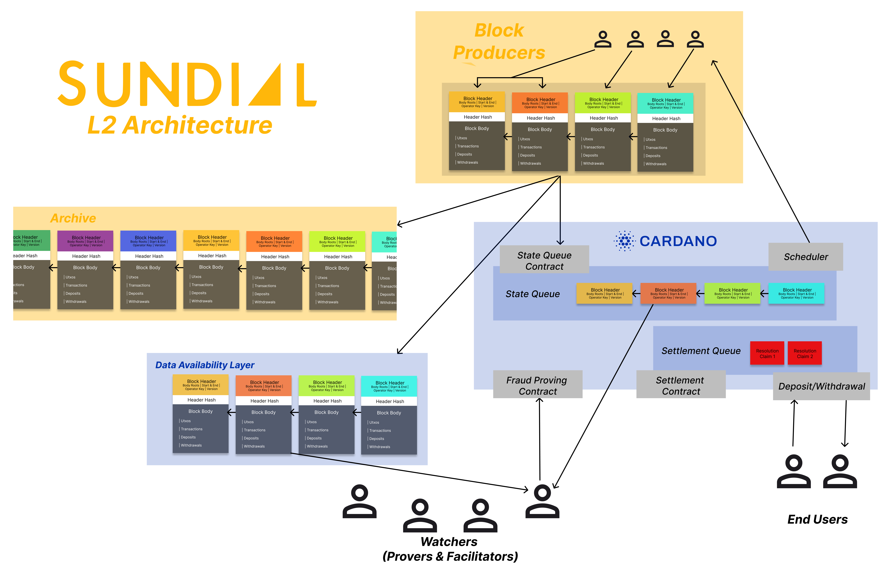

# SOC 2 Type I Readiness System Description - Sundial Node

Generated: 2026-08-17

## Purpose

This document describes the current Sundial node control environment as a
public-facing SOC 2 Type I readiness determination. It is intended to support
scoping, auditor onboarding, and institutional diligence preparation.

It is not:

- a SOC 2 report;
- a CPA attestation;
- a claim that Sundial has completed a Type I or Type II examination;
- a substitute for protocol audit, validator audit, formal verification, or
  mainnet launch approval.

The document answers four
questions clearly:

1. What system is being described?
2. Which controls already exist for that system?
3. Which existing repository documents already provide evidence of those
   controls?
4. Which gaps must be closed before the described system is credible as the
   system institutional users are actually exposed to?

## Scope

In scope:

- `demo/midgard-node` runtime roles: `api`, `tx-processor`, `sequencer`, and
  `all`.
- The current Sundial node API, transaction-ingress path, queueing,
  persistence, sequencing, commitment, merge, and observability flows.
- Supporting infrastructure and deployment boundaries referenced in
  [`../mainnet-readiness.md`](../mainnet-readiness.md), including AWS
  deployment posture, CI/security gates, secrets handling, and operational
  readiness.
- PostgreSQL, Redis Streams, Merkle-Patricia-Trie state, EFS-backed storage,
  L1 provider dependencies, and Cardano L1 interactions as they affect node
  operation.
- Existing testnet validation, baseline security, controlled-load, telemetry,
  disaster-recovery, and key-management documentation.

Out of scope:

- End-user wallet custody and end-user device security.
- Third-party service-provider internal security for AWS, Blockfrost, Kupo,
  Ogmios, or other external providers.
- Protocol-level formal correctness beyond what is documented in current
  readiness materials.
- CCSS, SOC 2, ISO 27001, or smart-contract certification or attestation.
- KYC, AML, customer onboarding, or customer profile storage systems outside
  `demo/midgard-node`.

## Operational Timeline

The node's readiness narrative distinguishes between the start of
testnet operation and the later existence of formal public release artifacts.
For consistency, this document treats the earliest live testnet use as a soft
launch and the first tagged node build as the beginning of formal release
packaging:

| Milestone | Date | Evidence |
| --- | --- | --- |
| Testnet soft launch | 2026-05-30 00:21:14 +0300 | `b336fb3c316ea1e93db5b97f65e3d3ba8aa8a15f` author date, subject `testnet v0` |
| First formal tagged node release artifact | 2026-07-30 08:32:45 +0300 | tag `sundial-node-20260730T053245Z-8ed15a6b54be` |

Timeline determination:

- treat 2026-05-30 as the start of Sundial testnet operational history and
  refer to it as the testnet soft launch;
- treat 2026-07-30 as the first formal tagged release artifact and use it
  when discussing packaged release cadence, reproducible builds, and public
  release references;
- use the soft-launch date when describing how long the system has been
  operating in testnet form;
- use the tagged-release date when describing when formal release management
  became externally visible;
- avoid collapsing these into a single date, because they answer different
  diligence questions;
- continue to distinguish testnet operating history from mainnet-equivalent
  operating history unless the control environment remains materially the same.

## Intended Use In A Future SOC 2 Process

This document is best understood as readiness material for a future SOC 2 Type
I exercise focused on the current Sundial node control environment.

The most natural initial emphasis is the Security category, with Availability
and Processing Integrity as likely additional areas if and when management
chooses to include them. The document does not itself select trust-service
criteria or claim that any selected criteria have been independently examined.

Type I can only speak to the design of controls for the described system at a
point in time. If the production or mainnet system later uses different key
custody, IAM, deployment topology, observability, alerting, or public network
surface decisions than described here, the usefulness of the resulting report
to institutional reviewers falls sharply.

## Relationship To Other Documents

This document is a synthesis and index. It is not meant to replace the
underlying repository documents that actually describe the architecture,
controls, evidence, and gaps.

| Topic | Primary source | This document adds |
| --- | --- | --- |
| Node architecture, runtime components, data model, boot flow | [`../architecture.md`](../architecture.md) | Control-oriented system description and scope framing |
| Sundial layered architecture and protocol context | [`../architecture/layers/overview.md`](../architecture/layers/overview.md) | Placement of the node inside the larger Sundial stack |
| System interaction flows and existing diagrams | [`../architecture/layers/blueprint.md`](../architecture/layers/blueprint.md) | Diagram reuse and control-evidence references |
| Environment and runtime configuration | [`../environment.md`](../environment.md) | Secrets/control implications and scope mapping |
| API surface and route exposure | [`../api.md`](../api.md) | Access-control and operational-risk framing |
| Security best practices for integrators and operators | [`../security.md`](../security.md) | SOC-style summary of existing and missing controls |
| Mainnet deployment gaps and cutover readiness | [`../mainnet-readiness.md`](../mainnet-readiness.md) | Readiness conclusion and transfer-risk framing |
| Observability stack and telemetry semantics | [`../observability.md`](../observability.md), [`../telemetry.md`](../telemetry.md) | Monitoring-control and evidence-readiness framing |
| Testnet validation and load evidence | [`../master-test-plan.md`](../master-test-plan.md), [`../testing.md`](../testing.md), [`../scalability-stress-test-report.md`](../scalability-stress-test-report.md) | Mapping testing evidence into control-support language |
| Threat model | [`threat-model-stride.md`](threat-model-stride.md) | Trust-boundary and risk context for control design |
| Data handling | [`data-handling-addendum.md`](data-handling-addendum.md) | Data-scope summary for audit scoping |
| Key management | [`ccss-key-management.md`](ccss-key-management.md) | Mainnet custody risks that affect SOC 2 readiness |
| BCP/DR and recovery objectives | [`bcp-dr-rto-rpo.md`](bcp-dr-rto-rpo.md), [`../architecture/disaster-plan.md`](../architecture/disaster-plan.md) | Recovery-control summary and gap framing |
| Smart-contract caveats | [`../smart-contracts.md`](../smart-contracts.md) | Explicit boundary between node-control readiness and protocol correctness |

Where repository documents conflict in wording or appear to reflect different
ages of the system, the newer compliance, API, and mainnet-readiness documents
are the more authoritative description of the current control environment.

## System Boundary

The current system is described conservatively as the Sundial node and
its supporting control environment, not as the whole future Sundial protocol.

### Included Components

- Public or semi-public HTTP ingress to the node.
- Redis Streams queueing for submitted transaction CBOR.
- `tx-processor` role parsing, validation, retry, and dead-letter handling.
- PostgreSQL storage for mempool, blocks, ledgers, address history, user
  events, and other off-chain projections.
- LevelDB-backed Merkle-Patricia-Trie state mounted locally or on EFS.
- `sequencer` role for user-event sync, block commitment, L1 submission, and
  merge.
- L1 provider interaction through Blockfrost or Kupo/Ogmios.
- AWS deployment controls, IAM boundaries, secrets injection, and CI/security
  gates where they affect runtime behavior or privileged access.
- Observability stack and operational evidence surfaces: logs, metrics, traces,
  dashboards, and readiness checks.

### Excluded Components

- End-user wallets and user endpoint devices.
- Third-party bridge operator infrastructure not run by Sundial.
- Any future onboarding, KYC, or identity-management layer outside
  `demo/midgard-node`.
- Formal validator-level correctness guarantees not reflected in the current
  node control environment.

## Architecture Overview

The node exists inside a broader Sundial layered architecture already described
in the repository. This document reuses those diagrams rather than introducing
new ones.

### Primary Diagram: Layered Service Map


Use this diagram when the reader needs a high-level view of where the node,
APIs, operator toolkit, watcher toolkit, and supporting services sit within
Sundial's layered model.

### Primary Diagram: L2 Component Interactions



Use this diagram when the reader needs a protocol-facing view of block
producers, archive/data-availability relationships, Cardano settlement, state
queue, watchers, and end-user interactions.

### Reused Flow Diagrams

The existing sequence diagrams in
[`../architecture/layers/blueprint.md`](../architecture/layers/blueprint.md)
are the canonical interaction-flow diagrams for:

- Bitcoin bridge and release flows;
- Cardano deposit and withdrawal flows;
- user-facing integration points between UI, L1, L2, and service layers.

The existing role-focused images are useful as appendices or diligence support:

- [`../architecture/roles/user_flow_diagram.png`](../architecture/roles/user_flow_diagram.png)
  for user-facing transaction and fee-routing context;
- [`../architecture/roles/prover_flow_diagram.png`](../architecture/roles/prover_flow_diagram.png)
  for watcher/prover and fraud-proof context.

The block-header image
[`../architecture/blockheader.png`](../architecture/blockheader.png) is most
useful when discussing block commitments and processing-integrity semantics,
not as the primary system-overview diagram.

## Node Data Flow And Trust Boundaries

The clearest control-oriented description of the node today is the boundary
model already used in the STRIDE threat model:

```text
client / API ingress -> Redis Streams -> tx-processor -> Postgres/MPT state ->
sequencer fibers -> L1 provider -> Cardano L1
```

This boundary model is stable across `Preprod`, `Preview`, `Custom`, and
`Mainnet`. The architecture does not materially change when `NETWORK=Mainnet`;
the impact of compromise changes, and therefore the control expectations
change.

At a high level:

1. A client submits raw transaction CBOR to `POST /submit`.
2. The API process validates only the basic request format and appends the
   payload to a Redis Stream.
3. The `tx-processor` consumes entries, parses CBOR in worker threads,
   validates transactions, and inserts accepted state into the durable
   relational projection and mempool ledger views.
4. The `sequencer` role periodically fetches L1 user events, builds and stores
   commitments, submits them through the configured L1 provider, and advances
   block/projection state.
5. Merge logic advances confirmed state after committed blocks become available.

This is the part of the system that current repository evidence most strongly
supports for a Type I readiness discussion.

## Data Handling Summary

The current node data model is already described in
[`data-handling-addendum.md`](data-handling-addendum.md). In summary:

- PostgreSQL stores transactions, blocks, ledgers, user events, address
  history, and faucet claims when enabled.
- Redis Streams store submitted transaction CBOR and dead-letter records before
  durable acceptance into the mempool projection.
- LevelDB-backed MPT storage holds ledger-state representations derived from
  accepted transaction and event processing.
- Logs, metrics, and traces provide operational evidence rather than business
  source-of-truth records.

Important scoping point: `demo/midgard-node` does not currently store KYC, AML,
customer profile, or onboarding records. Its personal-data surface is limited
to blockchain-derived addresses, transaction and event metadata, and faucet
claim data where enabled.

## Control Environment Summary

The current node control environment is meaningful and documented, but not yet
complete enough to imply that all mainnet-facing institutional diligence
questions are closed. The table below summarizes the current posture.

| Control area | Current design and evidence | Mainnet transfer risk | Readiness status |
| --- | --- | --- | --- |
| System architecture and boundaries | Strong documentation in [`../architecture.md`](../architecture.md), [`threat-model-stride.md`](threat-model-stride.md), and existing architecture diagrams | Low, if kept current | Strong |
| Environment and configuration management | Detailed runtime/env contract in [`../environment.md`](../environment.md) | Mainnet tfvars, backend, and deploy examples still need parity work | Partial |
| API ingress and route exposure | Route inventory and role-specific router behavior documented in [`../api.md`](../api.md) | Public `POST /submit` and some operator-observability routes still rely on external controls | Partial |
| Secrets handling | AWS Secrets Manager posture documented; local `.env` posture explicitly scoped as non-production | Mainnet signer custody model and least-privilege role separation not final | Partial |
| Key management | Strong readiness analysis in [`ccss-key-management.md`](ccss-key-management.md) | Highest-transfer-risk area for mainnet institutional credibility | Partial |
| Threat modeling | Detailed STRIDE analysis with boundary-specific mitigations | Requires periodic update as deployment posture changes | Strong |
| Data handling | Clear inventory in [`data-handling-addendum.md`](data-handling-addendum.md) | Low, if node scope remains the same | Strong |
| Logging, metrics, traces | Good local and documented stack in [`../observability.md`](../observability.md) and [`../telemetry.md`](../telemetry.md) | Alert rules, paging, retention, and production auth posture remain open | Partial |
| Testing and validation | Strong testnet-scoped validation docs and controlled-load plan | Testnet validation does not itself establish mainnet operational sufficiency | Strong for testnet, partial for mainnet |
| BCP/DR | Detailed node recovery doc in [`bcp-dr-rto-rpo.md`](bcp-dr-rto-rpo.md) | Restore drills and mainnet-shaped objectives still required | Partial |
| CI/security gates | Existing PR quality and security gates documented in [`../mainnet-readiness.md`](../mainnet-readiness.md) | Terraform plan-review and mainnet blast-radius files need stronger gating | Partial |
| Public surface decisions | Mainnet-readiness doc identifies open issues clearly | Grafana exposure, API protection, and HTTPS-cutover decisions still open | Open |
| Protocol correctness boundary | Explicitly caveated in [`../smart-contracts.md`](../smart-contracts.md) | Current demo/testnet environment should not be represented as protocol-level production assurance | Open |

## Access Control And Privileged Operations

The current documentation shows that the node can be deployed either as a
monolith or as split roles. This is a meaningful control boundary, but it is
not a complete authorization model.

What exists today:

- `NODE_ROLE=api` serves a reduced route set relative to the full router.
- `GET /health/live` and `GET /health/ready` provide bounded health checks.
- Destructive or deeply operational routes are removed from `api` role nodes.
- AWS deployment materials and security docs emphasize reverse-proxy,
  gateway, or WAF controls for public deployments.

What remains a gap:

- The application layer does not provide a general authorization layer for the
  HTTP surface.
- `POST /submit` is intentionally open unless protected upstream.
- Some operator-observability routes remain reachable on `api` role nodes and
  are treated as privileged or sensitive.
- Mainnet relies on explicit network isolation, reverse-proxy controls, and
  route-level access decisions rather than assuming split-role deployment alone
  is sufficient.

## Secrets And Key Management

Secrets and key custody are the sharpest readiness issue for any future SOC 2
Type I discussion that aims to remain credible for mainnet-facing diligence.

The current repository already states the right distinction:

- local `.env` handling is appropriate for local development only;
- AWS Secrets Manager improves the current testnet deployment posture;
- mainnet moves toward stronger signer isolation, role-scoped runtime access,
  and a documented custody model.

The current key-management readiness work in
[`ccss-key-management.md`](ccss-key-management.md) identifies the main gaps
well:

- current signing remains application-managed;
- API compromise can become signing compromise unless mainnet roles are split
  more strictly;
- mainnet key ceremony, onboarding, backup, rotation, and key-compromise
  workflows still need to be finalized;
- mainnet avoids carrying testnet or faucet signing material into production
  scope.

For institutional review, this section is the primary reason not to imply that
the present system description automatically transfers to a final mainnet
control environment.

## Monitoring, Telemetry, And Operational Evidence

The observability stack is a relative strength of the current repository:

- local and documented Prometheus, Grafana, Loki, Tempo, Promtail, and
  cAdvisor integration exist;
- readiness, queue, mempool, commitment, merge, and infrastructure metrics are
  documented;
- traces and logs provide good engineering visibility into the transaction
  pipeline.

However, the mainnet-readiness work identifies a clear boundary between
engineering observability and auditable operational readiness:

- current materials document dashboards and scrape topology;
- they do not yet establish production alert rules, paging policy, notification
  channels, or formal retention expectations;
- public observability exposure, especially Grafana access posture, still
  requires an explicit mainnet decision.

This means the system is observability-capable today, but not yet fully
operationalized for production-grade incident detection and response.

## Testing, Validation, And Evidence

The repository already contains substantial readiness evidence in testnet form:

- [`../master-test-plan.md`](../master-test-plan.md) establishes repeatable
  validation scope, evidence collection, traceability, defect handling, and
  final validation conclusions for staging and testnet.
- [`../testing.md`](../testing.md) describes the automated test layers and
  quality/security gates.
- [`../scalability-stress-test-report.md`](../scalability-stress-test-report.md)
  defines controlled-load methodology, evidence expectations, and benchmark
  reporting shape.

These are real strengths for a future Type I story because they show that
engineering validation is already being run with evidence, traceability, and
residual-risk language rather than as ad hoc manual testing.

But they remain testnet-scoped by their own terms. The repository is explicit
that these materials do not replace production-readiness review, mainnet launch
assessment, or external audit work. That distinction is preserved here.

## BCP/DR And Recovery

The current repository has both a protocol-level disaster-recovery narrative
and a more audit-friendly node-level recovery document.

For control-readiness purposes, the node-level primary source is
[`bcp-dr-rto-rpo.md`](bcp-dr-rto-rpo.md), because it includes:

- recovery scenarios and stated RTO/RPO objectives;
- backup posture for Postgres, Redis, and MPT/EFS state;
- concrete recovery paths such as restart reconciliation, `/reset`, root-unit
  diagnostics, targeted repair, and restore workflows;
- measured-evidence caveats separating testnet/demo measurements from
  production claims.

The protocol-level
[`../architecture/disaster-plan.md`](../architecture/disaster-plan.md) remains
useful background, especially for escape-hatch and worst-case recovery
positioning, but it is not the primary auditable recovery-control document for
this system description.

## Smart-Contract And Protocol Caveat

This readiness document for the current node environment carries one
explicit caveat from [`../smart-contracts.md`](../smart-contracts.md):

- the current demo/testnet node runs against always-succeeds validators;
- application-level validation currently carries correctness burden that real
  on-chain validators would carry in a production protocol deployment;
- behavior observed in this environment is not presented as proof of
  production validator behavior.

This does not make the node-control environment useless for SOC 2 readiness.
It does mean the system is described honestly as the current node and control
environment, not as a completed production protocol assurance package.

## Mainnet Transfer Risks And Open Items

The following items are the main reasons a present-day Type I readiness package
requires careful treatment:

| ID | Open item | Why it matters |
| --- | --- | --- |
| SOC-B1 | Mainnet infrastructure parity is not yet fully encoded in checked-in env/backends/scripts | A Type I report only remains useful if the described environment matches the deployed one |
| SOC-B2 | Mainnet signer custody model is not final | Institutional reviewers will care deeply about operator key generation, storage, usage, and recovery |
| SOC-B3 | Application-layer auth is intentionally limited and relies on deployment controls | Public ingress and privileged endpoints need explicit production protection decisions |
| SOC-B4 | Alerting, paging, and production observability policy are not yet fully defined | Dashboards alone are not enough for operational readiness evidence |
| SOC-B5 | Some public surface decisions, especially Grafana exposure and route protection, remain open | These affect confidentiality, attack surface, and reviewer confidence |
| SOC-B6 | Testnet validation is strong, but mainnet-shaped topology and restore drills still need completion | Type I credibility improves when control design is anchored to the system users will actually face |
| SOC-B7 | Current demo/testnet validator posture is not equivalent to production validator assurance | The scope must remain node-control readiness, not a full protocol assurance claim |

## Evidence Index For A Future Audit Or Readiness Review

The following repository documents already form a strong starting evidence set
for a future auditor or readiness reviewer:

- [`../mainnet-readiness.md`](../mainnet-readiness.md)
- [`threat-model-stride.md`](threat-model-stride.md)
- [`ccss-key-management.md`](ccss-key-management.md)
- [`data-handling-addendum.md`](data-handling-addendum.md)
- [`bcp-dr-rto-rpo.md`](bcp-dr-rto-rpo.md)
- [`../architecture.md`](../architecture.md)
- [`../environment.md`](../environment.md)
- [`../api.md`](../api.md)
- [`../observability.md`](../observability.md)
- [`../telemetry.md`](../telemetry.md)
- [`../master-test-plan.md`](../master-test-plan.md)
- [`../testing.md`](../testing.md)
- [`../scalability-stress-test-report.md`](../scalability-stress-test-report.md)
- [`../security.md`](../security.md)
- [`../smart-contracts.md`](../smart-contracts.md)
- [`../architecture/layers/overview.md`](../architecture/layers/overview.md)
- [`../architecture/layers/blueprint.md`](../architecture/layers/blueprint.md)

## Readiness Position

Sundial is in a formal SOC 2 Type I readiness state for the current node
control environment.

That readiness position is supported by the existence of:

- a defined system boundary for the node, its runtime roles, data stores,
  ingress path, sequencing path, and supporting infrastructure;
- documented architecture, data-handling, threat-model, key-management,
  recovery, observability, testing, and mainnet-readiness materials;
- an evidence-oriented testnet validation structure with explicit scope,
  traceability, residual-risk language, and controlled-load methodology;
- identified control gaps that are already documented as concrete remediation
  items rather than remaining implicit or unknown.

This readiness position applies to the current node control environment as
described in this document. It does not, by itself, establish that Sundial is
ready to represent the package as a final mainnet-target SOC 2 Type I answer
for institutional diligence.

Sundial is ready for SOC 2 Type I scoping and readiness review for the current
node environment.

Sundial is not yet in a final mainnet-target Type I audit support state. That
state depends on the mainnet control environment being frozen and implemented
with material alignment across infrastructure topology, secrets handling, key
custody, role separation, ingress protection, observability and alerting, and
operational response procedures.

Formal conclusion:

Sundial has reached a documentable SOC 2 Type I readiness state for the
current node control environment. Advancement from readiness to final
mainnet-target Type I audit support requires closure or formal acceptance of
the open mainnet transfer items identified in this document, with particular
priority on infrastructure parity, signer custody, public surface decisions,
and operational monitoring and response.
