# M3.8 UI/UX Development Log

**Required**: Internal testing logs documenting UI feedback and iterations.

## Highlights

- 4/28 – Initial design mockups received from King David
- 5/2 - First internal review of prototype website
- 5/21 - Final design mockups received from King David
- 6/24 - Website development nearing completion, copywriting phase initiated
- 7/1 - Website launched (https://sundialprotocol.com)
- 9/5 - Financial dashboard prototype shared for internal feedback
- 9/25 - Financial dashboard prototype shared publicly for feedback (https://www.sundialprotocol.com/news/financial-dashboard)
- 10/14 - Further staking screen designs shared for feedback
- 10/20 - Updated UI demo video created showcasing functional flow

## Full Log

### Commits

See [Git log](./git-log.txt)

### Discussion

**April 24, 2025**

- **gUbGuuB (10:41 AM):**
  - CAN YA POST THE VERCEL LLINK HERE @sdelaney
  - WE HAD TO MAKE A PLACEHOLDER SITE, BUT WILL BE NICE TO START WORKING TOWARDS A MORE REAL ONE
- **sdelaney (10:46 AM):**
  - Ooh nice I can take some of the copy from that new site
  - https://sundial-web-sepia.vercel.app/
  - Sundial (Dev)
  - Unlocking Bitcoin Defi
- **gUbGuuB (10:47 AM):**
  - WILL GO OVER THE COPY AT SOME POINT TOO. WILL NEED TO WORK ON A LANDING NEXT
  - CAUSE THAT WILL GO LIVE SOONER. https://b.tc/conference/2025
  - Bitcoin 2025 - Las Vegas
  - The Bitcoin Conference is the world's largest gathering of bitcoiners. From breaking announcements and international media coverage to countless meaningful talks by thought-leaders and industry innovators, we are excited to continue our drive for global hyperbitcoinization. From May 27th - 29th, 2025, The Bitcoin Conference will be coming to Las Vegas.

**April 27 – April 29, 2025**

- **gUbGuuB (4/27 2:53 PM):** WHEN CAN WE GO OVER THE LANDING PAGE AND HAVE AN UPDATED SITE TO START REVIEWING? CAN WE GET ON THIS NEXT WEEK
- **sdelaney (4/27 6:39 PM):** Yeah I'm clear for this to be my primary focus this week
- **King David (4/28 1:34 PM):** starting work on this. here is a first mock to get the ball rolling 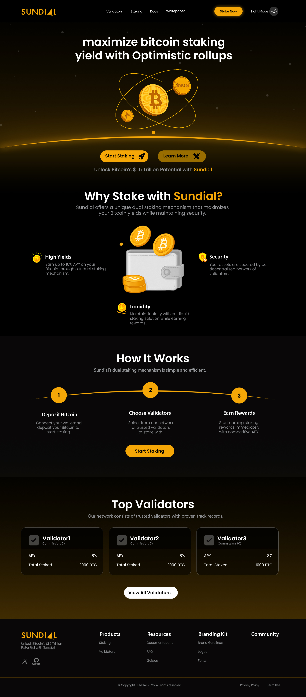
- **King David (4/29 11:58 AM):** Mock 2 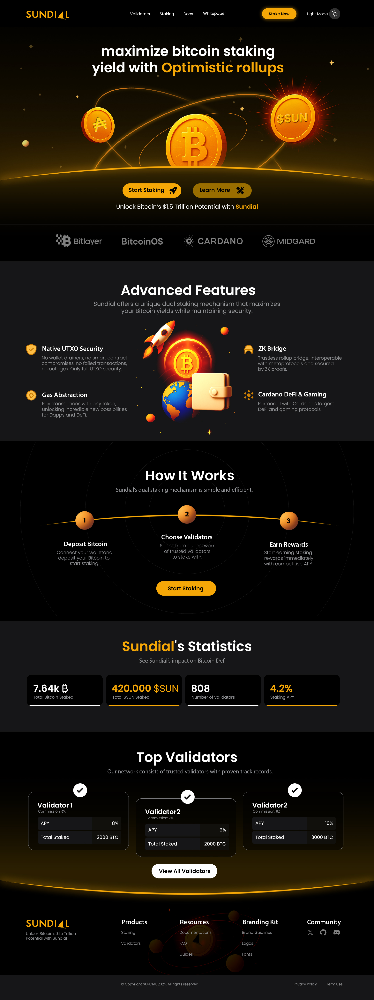
- **gUbGuuB (4/29 11:59 AM):** Will get feedback. Target is banks and institutions so flatter will be better. Love the sun looking elements 🌞
- **King David (4/29 12:04 PM):** section 2 is just AI place holder, but overall branding is sun/planet subtlety.
- **Sheldon (4/29 3:53 PM):** https://www.anastasialabs.com/ — Dis gud

**May 1 – May 6, 2025**

- **gUbGuuB (5/1 2:18 PM):** ADDED @King David @sdelaney FOR TOMORROWS WEBSITE CALL. IT'S THE PPL WHO MADE A PLACEHOLDER SITE TO SEE WHAT'S NEXT OR IF WE SHOULD MOVE TO ACTAUL SITE SOON
- **gUbGuuB (5/1 7:59 PM):** https://babylonlabs.io/ — ALSO, FORGOT TO LINK THIS REFERENEC
- **gUbGuuB (5/2 7:35 AM):** DO YOU WANT TO GO OVER WHAT WE HAVE SO FAR AFTER THIS? WE SHOULD MOVE TO THE ACTUAL SITE BEFORE CONSENSUS NEXT WEEK
- **gUbGuuB (5/2 8:10 AM):** AH, NVM NOT BEFORE CONSENSUS THEN. HAVE GOOD AMOUNT OF TIME TO WORK ON THE ACTUAL SITE. APPOLD IS MOSTLY HELPING WITH RESEARCH AND STUFF, SO THIS BROCHURE SITE WE SHOULDN'T SPEND MUCH MORE TIME ON
- **sdelaney (5/2 4:37 PM):** Anastasia Labs style advanced features section
<video controls src="https://github.com/user-attachments/assets/6d2167ea-afd6-422b-95f7-953ae604aca9" title="Title"></video>
- **sdelaney (5/5 5:35 PM):** proof of concept for a fancy roadmap page. before I put more time into polishing it up - is this too much?
<video controls src="https://github.com/user-attachments/assets/c00aa6e2-6b55-4876-a6a2-3a450a05defb" title="Title"></video>
- **King David (5/5 5:58 PM):** mock #3 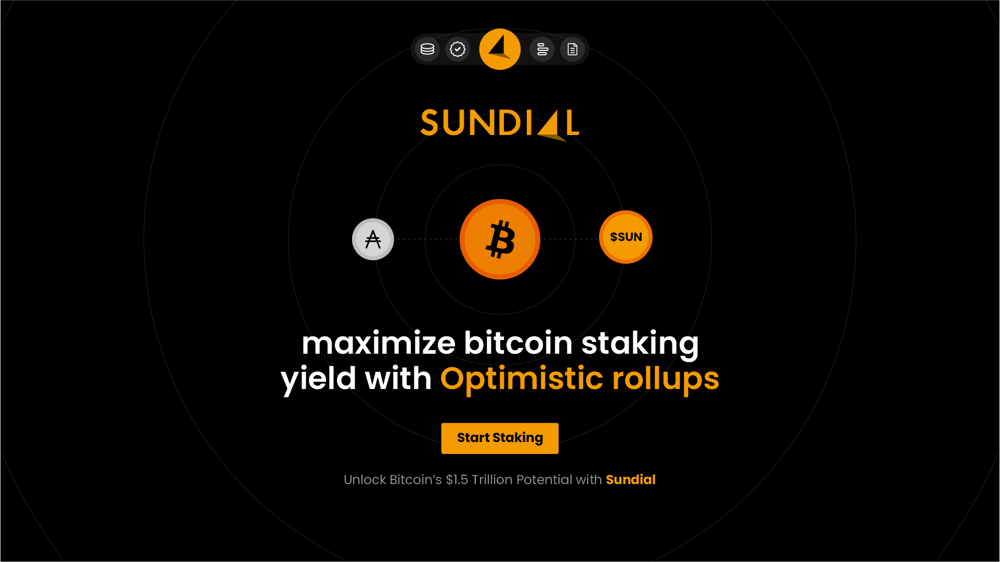 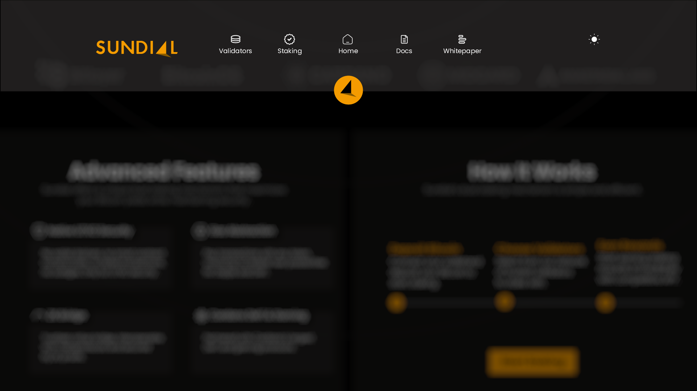  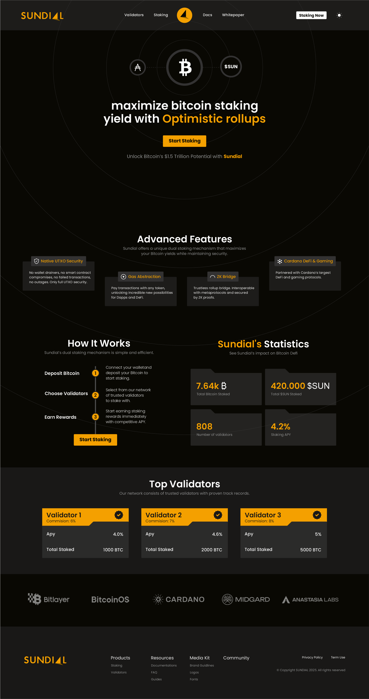 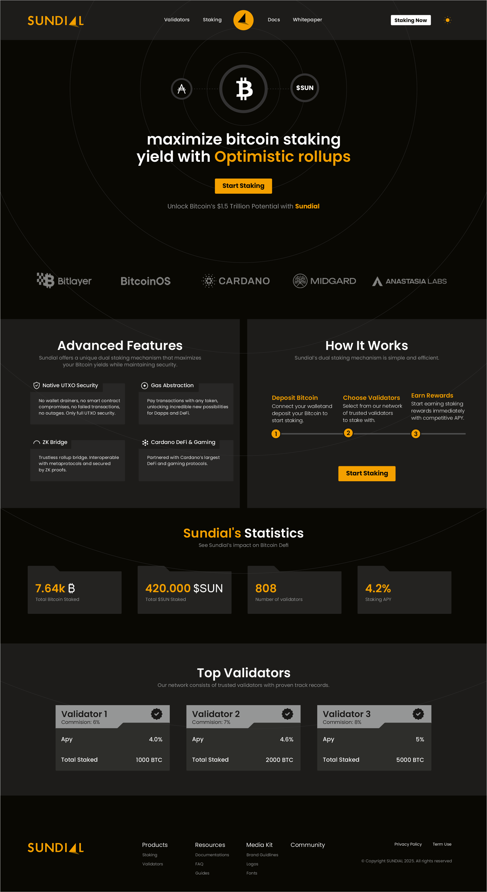 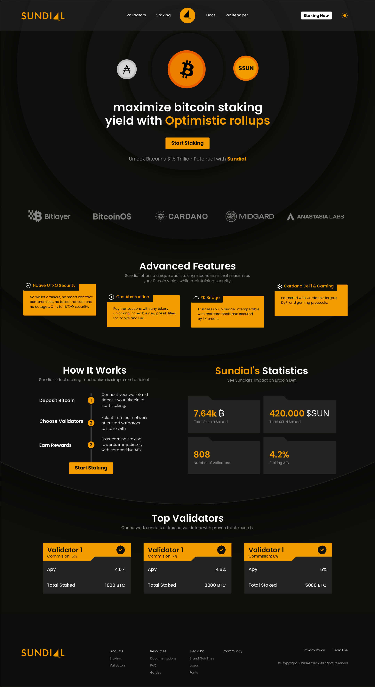
- **gUbGuuB (5/5 6:01 PM):** NICE! NOTES COULD BE NIGHT BOTTOM CAN BE CHANGED TO A SHADPW FROM AN ACTUAL SUNDIAL ON THE TOP. BITCOIN AS THE SUN. AND HOLES IN THE SUNDIAL CUTOUT WITH THE WORDS SO IT HAS IT IN THE SHADIQ
- **sdelaney (5/6 8:05 AM):** the sundial shadow shouldn't be too hard, but the cutout words sounds pretty hard. I'll givem a try. btc as the sun should be easy
- **sdelaney (5/6 8:22 AM):** I like the flat hero section! looks v good. thinking a combination of 1, 2 up top & 6 below with the features section from 4. @Sheldon you mind if I tweet this on my personal account just to show off the effect? Hid the sundial branding so it won't get connected to this project if we decide not to go with it.
- **Sheldon (5/6 10:40 AM):** Super cool. APPROVED!

**May 12 – June 24, 2025**

- **sdelaney (5/12 4:03 PM):** shadow 🙂 (also did a reflection in case we prefer that)
- **gUbGuuB (5/12 5:50 PM):** started a thread: shadow 🙂
- **sdelaney (5/20 4:31 PM):** new responsive navbar based on design mocks — https://sundial-web-git-sam-navbar-ikigai-technologies.vercel.app/
- **sdelaney (5/21 11:12 AM):** new hero section - version 1 — https://sundial-web-git-sam-hero-ikigai-technologies.vercel.app/
- **King David (5/21 2:21 PM):** Mock #4 to reference 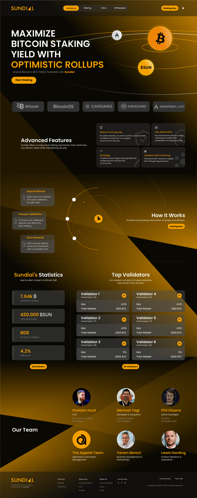 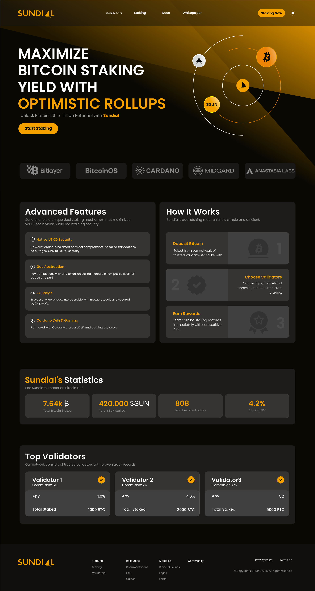 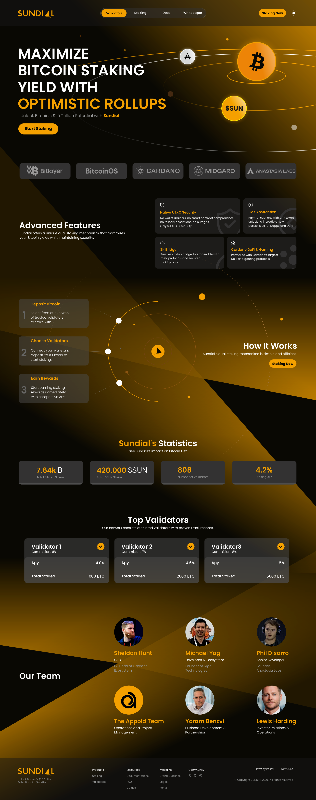
- **sdelaney (5/21 2:35 PM):** are there gonna be more mocks coming or are these all the mocks
- **King David (5/21 3:01 PM):** final mocks unless anyone else has ideas. looking for feedback to set the direction of branding.
- **sdelaney (5/29 5:35 PM):** team section from v4 (that vid also shows the narrower navbar you requested @King David)
<video controls src="https://github.com/user-attachments/assets/6d2167ea-afd6-422b-95f7-953ae604aca9" title="Title"></video>
- **sdelaney (5/29 5:55 PM):** started a thread: team section from v4
- **sdelaney (6/5 3:40 PM):** maintenance overlay for pages we're not ready to make public yet - also tried out the text scramble effect anastasia labs uses all over their site
- **sdelaney (6/6 4:15 PM):** news section prototype - not based on any design but realized it could be valuable
- **sdelaney (6/12 5:12 PM):** Whitepaper on the site
- **gUbGuuB (6/13 11:58 AM):** CLEAAN
- **sdelaney (6/21 3:50 PM):** Added scroll snap to the site, think it makes the sunbeams feel a lot better
- **sdelaney (6/24 7:12 PM):** Still some beautification to do but the website is close enough now that we should start working on the copy. Who should I work with to get that done? @gUbGuuB @Sheldon?

**September 2025**

- **sdelaney (9/5 8:13 AM):** Here's a first draft of the financial dashboard @King David interested in feedback if you have it
- **sdelaney (10/14/2025 8:32 AM):** couple staking screens for feedback @King David

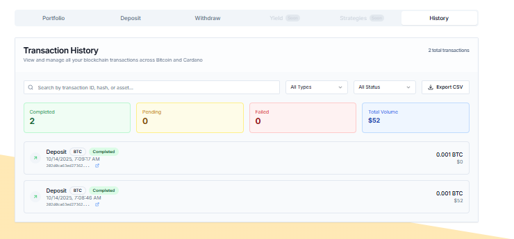
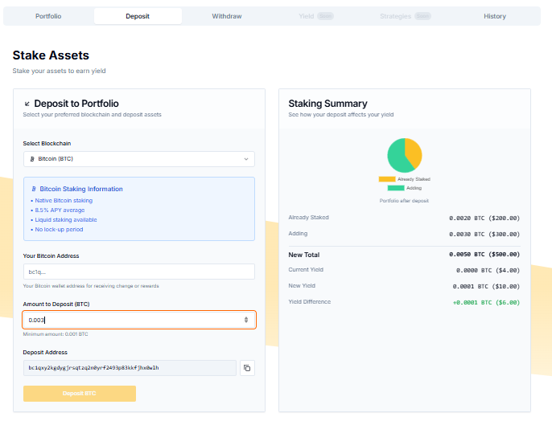
---
