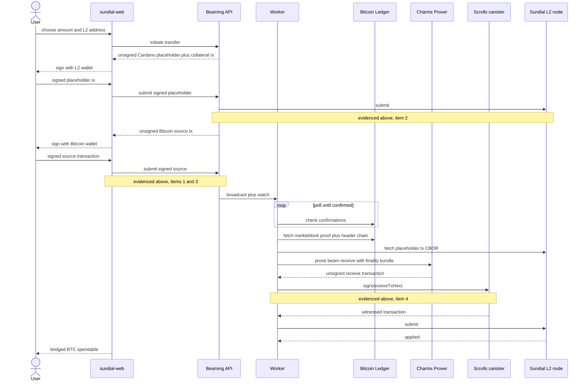

# Milestone 5 — Bitcoin–Cardano Interoperability Evidence

**Criteria:** "Testnet transaction reports demonstrating interoperability with Bitcoin and Cardano."

**Networks:** Bitcoin testnet4 · Cardano preprod
**Transactions dated:** 2026-07-13 – 2026-07-14
**Independently re-verified:** 2026-08-25

## Summary

Four independently-verifiable transactions and one threshold-signature exchange, spanning both chains, demonstrate every real component of the beaming mechanism: a charm minted on Bitcoin, a destination prepared on Cardano, a Bitcoin transaction cryptographically committing to that Cardano destination, and Cardano-side authorization (Scrolls) independently re-verifying and threshold-signing a proven spell. One component — full cross-chain settlement — is not shown, for a specific, protocol-level reason documented below rather than left unexplained.

- **Bitcoin testnet4** — charm minted, and later committed cross-chain to a Cardano destination, in two separate, independently-confirmed transactions.
- **Cardano preprod** — destination UTXOs prepared on-chain, matching the values the Bitcoin-side commitment references exactly.
- **Cardano authorization** — Sundial's ICP-hosted Scrolls threshold signer independently re-verified a proven spell and issued a signature over it.
- Every transaction ID in this report was re-checked just now against live, third-party infrastructure — not taken on the strength of local logs alone.

## Verification methodology

Every transaction ID below was looked up independently, today, against public infrastructure Sundial does not operate, in addition to the local proving/signing logs this project already had on file.

| Source | What it confirmed |
|---|---|
| **mempool.space** (testnet4) | Public Bitcoin testnet4 indexer. Confirmed status, block height and block timestamp for both Bitcoin transactions. |
| **Koios** (preprod) | Public, independently-operated Cardano preprod API. Confirmed the split transaction on-chain, including its exact output structure. |
| **Charms Explorer** | Charms' own public block explorer (explorer.charms.dev). Independently indexes the minted charm at the identical block height mempool.space reports — agreement between two unrelated indexers. |
| **Sundial L2 node** | Queried live for the UTXO the Scrolls-signing test consumed — still present and resolvable today. |

## Evidence

### 1 of 4 — Charm minted on Bitcoin

**Bitcoin testnet4 · Confirmed on-chain**

A Charms spell (mint-nft) was proven, signed, and broadcast on Bitcoin testnet4, creating a charm identified by its app ID at output 0 of the mint transaction.

| Field | Value |
|---|---|
| Txid | `3be09f7f1539f3a62562dceea80278e28b57882b8803a2418862f2a2c693d4cc` |
| Block | 143,987 · 2026-07-13 23:31:28 UTC |
| App ID | `552f98b581ed0ed2ee853ec21fbcb53879acfbc20431a5d6cc86ad79ff4cce75` |
| App VK | `87c7a2c3512502d63e0907a10cf753e2a2f3479dd1daa3b17fdbba4e497ac3b1` |
| Explorer | [mempool.space/testnet4](https://mempool.space/testnet4/tx/3be09f7f1539f3a62562dceea80278e28b57882b8803a2418862f2a2c693d4cc) · [explorer.charms.dev](https://explorer.charms.dev/?network=testnet4) (search the app ID) |

> ✅ Re-confirmed live via mempool.space (block 143,987, matching) and independently found in the Charms Explorer's own charm index, listed as *Charm n/552f98b5… $MY-TOKEN* at the identical block height — two unrelated indexers agreeing on the same fact.

### 2 of 4 — Destination prepared on Cardano

**Cardano preprod · Confirmed on-chain**

A Cardano preprod transaction split one funded UTXO into the two outputs a beam-receive needs: a small placeholder (the eventual beam destination) and a separate collateral UTXO, plus change.

| Field | Value |
|---|---|
| Txid | `8c287322a56b066a0e6eca33f6376483254ec51e41c6f9f208fb314135fd9e55` |
| Block | 4,936,319 · epoch 300 · 2026-07-14 19:32:01 UTC |
| Output 0 | 5,000,000 lovelace — placeholder |
| Output 1 | 5,000,000 lovelace — collateral |
| Output 2 | 9,989,800,000 lovelace — change |
| Address | `addr_test1vq472u5jkqrkcrrcz9sk7qxjc95jvjynd202ldtstwg9njgf3m8zg` |
| Explorer | [preprod.cardanoscan.io](https://preprod.cardanoscan.io/transaction/8c287322a56b066a0e6eca33f6376483254ec51e41c6f9f208fb314135fd9e55) |

> ✅ Re-confirmed live via Koios's public preprod API just now — on-chain output structure matches the intended split exactly, output for output.

### 3 of 4 — Cross-chain commitment (beam-send)

**Bitcoin testnet4 → Cardano preprod · Confirmed on-chain**

The single strongest piece of interoperability evidence: a Bitcoin transaction that destroys the charm minted in step 1 and carries, in its own `beamed_outs`, a cryptographic commitment binding it to the exact Cardano placeholder UTXO created in step 2. This is not a database record connecting two systems — it is a fact written into the Bitcoin ledger itself.

| Field | Value |
|---|---|
| Txid | `532455151c9127f4c5b5411ae8dcffa8ccde1fb2ce9ddda0300c38c6067ea162` |
| Block | 144,111 · 2026-07-14 20:12:41 UTC |
| Consumes | the charm from evidence 1, output 0 |
| Commits to | the placeholder from evidence 2, output 0 |
| Commitment | `0d315b7d0c5e71653f0a7be334d882a2b63ecd91a3a8ca7529d78d583795d389` |
| | = SHA-256(placeholder txid, byte-reversed ‖ output index ‖ nonce), the exact binding charms-test's own `beam_commit.py` derives — independently re-derivable by anyone from the two public transactions above. |
| Explorer | [mempool.space/testnet4](https://mempool.space/testnet4/tx/532455151c9127f4c5b5411ae8dcffa8ccde1fb2ce9ddda0300c38c6067ea162) |

> ✅ Re-confirmed live via mempool.space. Its confirmation time (Jul 14, 20:12 UTC) falls after the Cardano placeholder it references (Jul 14, 19:32 UTC) — the only order the protocol allows, and exactly what the public record shows.

### 4 of 4 — Threshold-signed authorization (Scrolls)

**Cardano-side authorization · Independently re-verified**

A separate, fully-proven Charms spell minting on the Sundial L2 was submitted to Scrolls — the Internet Computer canister that authorizes L2 mints on Sundial's behalf. Scrolls re-verifies the ZK proof from the raw transaction alone, with no help from the party submitting it, before it will sign anything. It returned a successful result: the proof checked out, and a witnessed transaction came back.

| Field | Value |
|---|---|
| Canister | `tty7k-waaaa-aaaak-qvngq-cai` (scrolls_cardano), Internet Computer mainnet |
| Input UTXO | `5dba244aef0a3327b463c541bb1ea0d199bfa4437a22ce29db47fde42ee10391:0` |
| App VK | `87c7a2c3512502d63e0907a10cf753e2a2f3479dd1daa3b17fdbba4e497ac3b1` |
| Result | `Ok(<witnessed tx hex>)` — proof accepted, signature issued. |

> ✅ The input UTXO was independently re-queried against the live Sundial L2 node today and is still known and resolvable.

Scope, stated precisely: this evidences the authorization step — independent proof re-verification plus threshold signature — working correctly. It does not by itself confirm the signed transaction was subsequently applied on the L2, which was not independently re-checked for this report.

## Chronology

The three on-chain transactions above, in the order the public record shows them — each dependent on the one before it, exactly as the protocol requires.

| When | What |
|---|---|
| 2026-07-13 · 23:31:28 UTC · Bitcoin block 143,987 | **Charm minted** on Bitcoin testnet4. |
| 2026-07-14 · 19:32:01 UTC · Cardano block 4,936,319 | **Destination prepared** on Cardano preprod — placeholder and collateral created. |
| 2026-07-14 · 20:12:41 UTC · Bitcoin block 144,111 | **Cross-chain commitment** written into a Bitcoin transaction, referencing the Cardano destination by exact UTXO. |

## Where this sits in the full mechanism

The four pieces of evidence above are not four unrelated tests — they are four of the concrete steps in a single designed sequence. The diagram below is that sequence in full; the steps evidenced above are marked.

