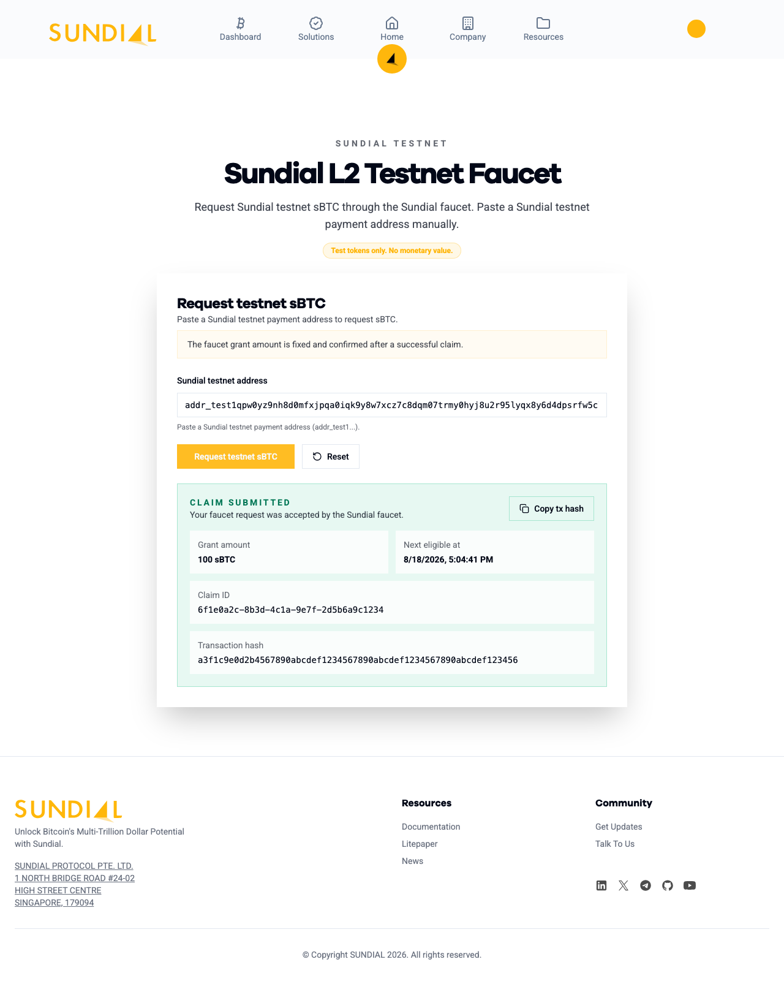

# Sundial Testnet — User Guide

This is an **end-user** guide: how to get a wallet, get testnet sBTC from the
faucet, and (optionally) explore the Sundial demo dashboard. It does not
assume any programming background.

If you're a developer integrating with the node's HTTP API, see
[api.md](./api.md) instead. If you're looking for security/rate-limit
behavior of the faucet endpoint, see
[security.md](./security.md#no-built-in-authentication-or-rate-limiting).

## What is the Sundial testnet?

Sundial is building Bitcoin-native yield infrastructure. The testnet lets you
try the product using **test tokens that have no real value** — nothing you
do here touches real BTC, ADA, or money.

The faucet at
[sundialprotocol.com/testnet/faucet](https://www.sundialprotocol.com/testnet/faucet)
gives out free **testnet sBTC** — Sundial's synthetic BTC token on Sundial,
Sundial's Layer 2. You'll receive it at an address on that L2, which uses the
same `addr_test1…` bech32 address format used by the settlement L1's testnet
(the UTXO-based L1 testnet Sundial currently settles to).

> Everything below is test-only. Never send real funds to a testnet address,
> and don't reuse a wallet that holds real money for testnet activity.

## What you need

Just a **UTXO-compatible wallet browser extension**, set to the testnet
network. You do not need any ADA, BTC, or other funds to get started — the
faucet is how you receive your first testnet sBTC.

Any of these extensions work (all support the CIP-30 standard the faucet page
and Sundial's L2 rely on):

| Wallet | Notes |
| --- | --- |
| [Eternl](https://eternl.io/) | Recommended — easy network switching, widely used |
| [Lace](https://www.lace.io/) | Recommended — official IOG wallet, simple UI |
| [Typhon](https://typhonwallet.io/) | |
| [Yoroi](https://yoroi-wallet.com/) | |
| [GeroWallet](https://gerowallet.io/) | |
| [NuFi](https://nu.fi/) | |

You only need one. Install it as a browser extension, create or restore a
wallet, and keep going.

> A separate Bitcoin wallet (e.g. for the demo dashboard's "Connect Wallet"
> button) is optional and covered in [Explore the demo dashboard](#optional-explore-the-demo-dashboard)
> below — you don't need one just to claim faucet funds.

## Step 1 — Switch your wallet to testnet and copy your address

1. Open your wallet extension.
2. Find its network setting (usually in Settings, sometimes a network name in
   the top bar) and switch it from **Mainnet** to **Testnet** / **Preprod**.
   Every wallet listed above supports this — the exact menu wording varies.
3. Once switched, open the **Receive** screen and copy your **payment
   address**. A testnet address always starts with `addr_test1`.

If your wallet is still on Mainnet, its address will start with `addr1`
instead — that won't work with the faucet (see
[Troubleshooting](#troubleshooting-faucet-errors) below).

## Step 2 — Request testnet sBTC from the faucet

1. Go to
   [sundialprotocol.com/testnet/faucet](https://www.sundialprotocol.com/testnet/faucet).
2. Paste your `addr_test1…` address into the **Sundial testnet address**
   field.
3. Click **Request testnet sBTC**.
4. On success you'll see a confirmation with:
   - **Grant amount** — how much testnet sBTC you received.
   - **Next eligible at** — when this address can claim again (each address
     has a cooldown between claims).
   - **Claim ID** and **Transaction hash** — reference IDs for the claim; the
     transaction hash can be copied with the button next to it.

   

That's it — no wallet connection or signature is required for this step, you
just paste an address you control.

## Troubleshooting faucet errors

If the request doesn't succeed, the page shows a specific reason:

| What you see | What it means | What to do |
| --- | --- | --- |
| "Enter a valid Sundial testnet payment address" / address must start with `addr_test1` | The field is empty or the address isn't a testnet address | Make sure your wallet is switched to Testnet/Preprod, then copy the address again |
| "This address has already claimed recently" (Cooldown) | You already claimed with this address inside its cooldown window | Wait until the "Next eligible at" time shown, or use a different testnet address |
| "This browser has reached the current faucet claim limit" | Too many successful claims have come from your network/IP recently | Try again later, or from a different network |
| "The faucet is temporarily out of funds" (Depleted) | The faucet wallet is low on testnet sBTC | Try again later — this is refilled periodically |
| "The faucet is currently unavailable" | The faucet is disabled, misconfigured, or the node can't be reached | Try again shortly; if it persists, let the Sundial team know |

Address-related errors (invalid format, wrong network, no payment
credential, or a script/contract address) all mean the same practical thing:
paste a normal receive address copied from a testnet-mode wallet, not a stake
address, script address, or a mainnet address.

## Step 3 — Confirm you received your funds

Refresh the balance in your wallet extension (still on the Testnet/Preprod
network) — your testnet sBTC balance should reflect the grant amount shown
in the confirmation.

Note that this balance lives on Sundial's Sundial L2, not on the settlement
L1, so it will not show up on the settlement L1's own general-purpose block
explorers. There isn't yet a public Sundial L2 block explorer during the
testnet phase — your wallet's balance, and the claim confirmation shown on
the faucet page, are the way to confirm a claim went through.

## Testnet network details

For reference, or if you're comparing notes with the Sundial team:

- **Faucet page:** `https://www.sundialprotocol.com/testnet/faucet`
- **Testnet address format:** `addr_test1…` (UTXO-based L1 testnet format)
- **Testnet sBTC units:** displayed amounts are in sBTC; 1,000,000 of the
  underlying base unit ("lovelace") = 1 sBTC, matching how the faucet page
  formats the grant amount.
- **Per-claim limits:** each address has a cooldown before it can claim
  again, and there's a daily cap on claims from a given network/browser. The
  exact cooldown for your claim is always shown in the confirmation — these
  limits exist purely to keep the shared faucet available for everyone
  testing, not to restrict genuine testing.

You do not need to interact with the underlying node RPC directly to use the
faucet or hold testnet sBTC — the web page handles that for you. The faucet's
backing node lives at `https://sundial-node.testnet.sundialprotocol.com`, but
claim submission specifically requires a server-side credential the faucet
page holds on your behalf, so claims must go through the web page rather than
a direct API call.

## Explore the demo dashboard

Sundial's [dashboard](https://www.sundialprotocol.com/dashboard) shows what
the full Bitcoin-yield product looks like: connecting a wallet, depositing,
and tracking positions. On testnet it runs against **Bitcoin's testnet3
network**, using a separate Bitcoin wallet (not the UTXO-based L1 wallet from
above) connected through the page's **Connect Wallet** button.

> The dashboard is an early-stage, test-only preview — transactions and
> balances there are simulated for demonstration purposes. Make sure any
> wallet you connect there is also set to testnet3, and never send real BTC
> to it.

This is a separate, optional flow from claiming faucet sBTC — you can use the
faucet on its own without ever connecting a wallet to the site.

## Sending your testnet sBTC to someone else

There isn't a "Send" button for this yet — the demo dashboard covers
depositing and tracking yield positions on **Bitcoin's testnet3 network**,
which is a separate flow from the testnet sBTC balance you just claimed on
Sundial's L2.

Paying another address with your testnet sBTC means talking to Sundial's L2
node directly, not just your wallet: something has to look up your spendable
testnet sBTC and hand a signed transaction to Sundial's node, because a
wallet's built-in "Send" only knows about the regular settlement-L1 network, not
Sundial's L2. The good news: you don't have to write that yourself. A small
command-line tool in this repo, `midgard` (`demo/midgard-manager/packages/cli`),
does it for you — no coding required, just commands typed into a terminal.
(If you *are* integrating this into your own app instead, see
[api.md](./api.md#2-build-a-transaction-to-submit).)

> The transcripts below were captured against a local test instance, so the
> addresses, keys, and hashes are all real but only meaningful in that
> instance. Point `--endpoint` at the public node from
> [Testnet network details](#testnet-network-details) (or a node you're
> running yourself) and you'll see the same output shapes with your own
> values. The CLI defaults to `http://localhost:3000` if `--endpoint` is
> omitted.

### Install and build the CLI

From a checkout of this repo:

```
$ cd demo/midgard-manager/packages/cli
$ pnpm install
$ pnpm build
```

Every command below is `node dist/bin.js <command>` — the same binary is also
installable as `midgard` (see the package's `bin` field), and `pnpm start
<command>` rebuilds automatically if you're editing it. The CLI prints a
banner on every run; it's trimmed from the transcripts below after the first
one.

### Create a wallet

```
$ node dist/bin.js wallet create alice
┌─ 🌞 SUNDIAL MANAGER 
│ CLI Tool for Testnet
└────────────
✓ Created wallet: alice
Address: addr_test1vqfyf53z2m7wd2nlqys7cq9wvnryv2eeqd6xpqkx0pj9r5c8skzr8
Private Key: ed25519_sk...vtpwa

Fund it from the faucet, then check its balance with:
$ midgard wallet balance alice
```

This generates a fresh keypair and prints its `addr_test1…` address — the
same address format as the browser-wallet flow above. `wallet import <name>
--private-key <ed25519_sk...>` registers a key you already have instead of
generating a new one. `wallet list` and `wallet address <name>` show what
you've created:

```
$ node dist/bin.js wallet list
Available wallets:
 • alice — addr_test1vqfyf53z2m7wd2nlqys7cq9wvnryv2eeqd6xpqkx0pj9r5c8skzr8
 • bob — addr_test1vpmkj5p7v93m2j5m5laqj27w2u6veqcgnfrt3zt50cvkunqs0rnyz
```

The private key never leaves your machine — it's stored in plaintext at
`demo/midgard-manager/config/wallets/default.json`, which is git-ignored.
Treat it exactly like the "test-only" wallets earlier in this guide: fine for
testnet, never for anything holding real value.

### Fund it, then check the balance

Copy the printed address into the faucet, same as [Step
2](#step-2--request-testnet-sbtc-from-the-faucet) above. Before funding,
`wallet balance` genuinely shows zero:

```
$ node dist/bin.js wallet balance alice
Balance for alice (addr_test1vqfyf53z2m7wd2nlqys7cq9wvnryv2eeqd6xpqkx0pj9r5c8skzr8):
  0.000000 sBTC
  (0 lovelace across 0 UTxO(s))
```

After a faucet claim lands, the same command shows the real balance:

```
$ node dist/bin.js wallet balance alice
Balance for alice (addr_test1vqfyf53z2m7wd2nlqys7cq9wvnryv2eeqd6xpqkx0pj9r5c8skzr8):
  100.000000 sBTC
  (100000000 lovelace across 1 UTxO(s))
```

### Send funds

```
$ node dist/bin.js send --from alice --to addr_test1vpmkj5p7v93m2j5m5laqj27w2u6veqcgnfrt3zt50cvkunqs0rnyz --amount 1.5
Sending 1.5 sBTC from alice (addr_test1vqfyf53z2m7wd2nlqys7cq9wvnryv2eeqd6xpqkx0pj9r5c8skzr8) to addr_test1vpmkj5p7v93m2j5m5laqj27w2u6veqcgnfrt3zt50cvkunqs0rnyz...
✓ Sent 1.5 sBTC to addr_test1vpmkj5p7v93m2j5m5laqj27w2u6veqcgnfrt3zt50cvkunqs0rnyz
Transaction hash: 17b6ed8627fd65838003ca00d4c4ebd78a4494e0f9baf256cfffd60c982842af
Check it with: midgard tx-lookup 17b6ed8627fd65838003ca00d4c4ebd78a4494e0f9baf256cfffd60c982842af
```

`--amount` is in sBTC (matching the faucet's display unit), not lovelace.
Signing happens with the locally stored private key above — this is *not*
the CIP-30 browser-wallet flow from earlier in this guide, it's the
raw-private-key path meant for a terminal tool.

Trying to send before funding the wallet fails honestly, not silently:

```
$ node dist/bin.js send --from alice --to addr_test1vpmkj5p7v93m2j5m5laqj27w2u6veqcgnfrt3zt50cvkunqs0rnyz --amount 1.5
Sending 1.5 sBTC from alice (addr_test1vqfyf53z2m7wd2nlqys7cq9wvnryv2eeqd6xpqkx0pj9r5c8skzr8) to addr_test1vpmkj5p7v93m2j5m5laqj27w2u6veqcgnfrt3zt50cvkunqs0rnyz...
Failed to send: { Complete: Your wallet does not have enough funds to cover the required assets: {
  "lovelace": "1657977n"
}
      Or it contains UTxOs with reference scripts; which are excluded from coin selection. }
Is the node running? Check with: midgard node node-status
```

That error is Lucid Evolution's own coin-selection message, passed through
as-is — a bit raw, but it means exactly what it says: fund the wallet first.

### Look up a transaction

```
$ node dist/bin.js tx-lookup 17b6ed8627fd65838003ca00d4c4ebd78a4494e0f9baf256cfffd60c982842af
Not found: 17b6ed8627fd65838003ca00d4c4ebd78a4494e0f9baf256cfffd60c982842af
It may still be queued for processing — try again in a few seconds.
```

A transaction hash from `send` isn't necessarily visible right away —
`POST /submit` (which `send` uses under the hood) just queues it; a
background worker on the node parses and validates it shortly after. Give it
a few seconds and try again if you see "Not found" for a hash you just sent.

### If something's not working

`node node-status` checks the node directly and is the first thing to run if
`send` or `wallet balance` can't connect:

```
$ node dist/bin.js node node-status --endpoint http://localhost:3010
- Checking Sundial node status at http://localhost:3010...
✔ Node is online but not ready

📊 Sundial Node Status

• Live: yes
• Ready: no (not_ready)
• Failing subsystems: l1Provider
• Endpoint: http://localhost:3010
```

"Live" means the process is up; "Ready" additionally checks its database,
cache, and UTXO-based L1 connection — a node can be live but not ready (as
above) while one of those is still starting up or misconfigured.

## Safety reminders

- Testnet tokens (sBTC, and Bitcoin testnet3 coins) have **no monetary
  value**. Don't buy, sell, or trade them as if they did.
- Keep testnet wallets and seed phrases separate from any wallet holding real
  funds. Never enter a seed phrase you use for real assets into a testnet
  flow.
- If the faucet or dashboard behaves unexpectedly, that's useful testnet
  feedback — please report it to the Sundial team rather than assuming it's
  something you did wrong.
